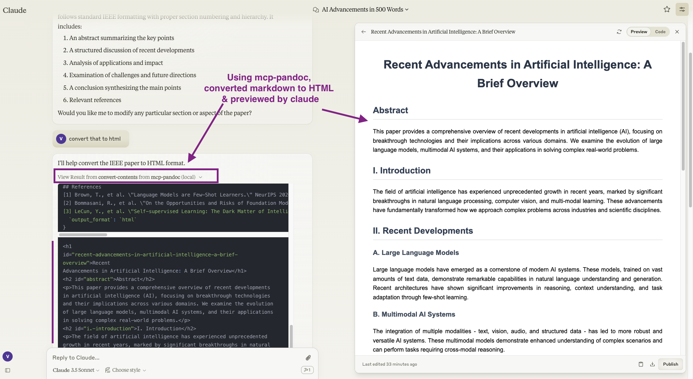

# mcp-pandoc: A Document Conversion MCP Server

## Overview

A Model Context Protocol server for document format conversion using pandoc. This server provides tools to transform content between different document formats while preserving formatting and structure.

Please note that mcp-pandoc is currently in early development. PDF support is under development, and the functionality and available tools are subject to change and expansion as we continue to improve the server.

## Demo



More to come...

### Tools

1. `convert-contents`
   - Transforms content between supported formats
   - Inputs:
     - `contents` (string): Source content to convert
     - `output_format` (string): Target format (html, markdown, text)
   - Returns: Converted content in the target format

### Supported Formats

Currently supported formats:

- Plain text
- Markdown
- HTML

In development:

- PDF

## Usage & configuration

To use the published one

```bash
{
  "mcpServers": {
    "mcp-pandoc": {
      "command": "uvx",
      "args": ["mcp-pandoc"]
    }
  }
}
```

## Quickstart

### Install

#### Claude Desktop

On MacOS: `~/Library/Application\ Support/Claude/claude_desktop_config.json`
On Windows: `%APPDATA%/Claude/claude_desktop_config.json`

<details>
  <summary>Development/Unpublished Servers Configuration</summary>
  
  ```bash
  "mcpServers": {
    "mcp-pandoc": {
      "command": "uv",
      "args": [
        "--directory",
        "/Users/vivekvells/Desktop/code/ai/mcp-pandoc",
        "run",
        "mcp-pandoc"
      ]
    }
  }
  ```
  
</details>

<details>
  <summary>Published Servers Configuration</summary>

  ```bash
  "mcpServers": {
    "mcp-pandoc": {
      "command": "uvx",
      "args": [
        "mcp-pandoc"
      ]
    }
  }
  ```

</details>

## Development

### Building and Publishing

To prepare the package for distribution:

1. Sync dependencies and update lockfile:

```bash
uv sync
```

2. Build package distributions:

```bash
uv build
```

This will create source and wheel distributions in the `dist/` directory.

3. Publish to PyPI:

```bash
uv publish
```

Note: You'll need to set PyPI credentials via environment variables or command flags:

- Token: `--token` or `UV_PUBLISH_TOKEN`
- Or username/password: `--username`/`UV_PUBLISH_USERNAME` and `--password`/`UV_PUBLISH_PASSWORD`

### Debugging

Since MCP servers run over stdio, debugging can be challenging. For the best debugging
experience, we strongly recommend using the [MCP Inspector](https://github.com/modelcontextprotocol/inspector).

You can launch the MCP Inspector via [`npm`](https://docs.npmjs.com/downloading-and-installing-node-js-and-npm) with this command:

```bash
npx @modelcontextprotocol/inspector uv --directory /Users/vivekvells/Desktop/code/ai/mcp-pandoc run mcp-pandoc
```

Upon launching, the Inspector will display a URL that you can access in your browser to begin debugging.
